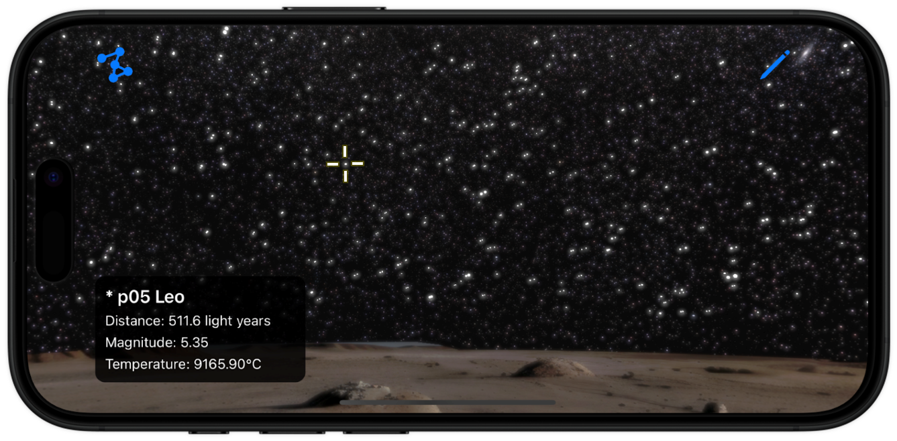

# 🪐 Exosky iOS App 📱

Ever wondered what the night sky looks like from an alien planet? **Exosky** takes you on a journey through the stars, allowing you to explore the universe from the perspective of distant exoplanets. See familiar constellations in a new light and experience the vastness of space like never before.

With Exosky, you can:

- Explore the stars and constellations as seen from various exoplanets.
- Compare how Earth's constellations appear from these far-off worlds.
- Get creative by drawing your own constellations in uncharted skies!

Embark on an interstellar adventure and discover the cosmos from an entirely new viewpoint.

---

## Repository Structure

This repository consists of two main folders: `Data` and `App`.

### `Data` Folder

The `Data` folder contains all the necessary data used in the app, along with the Python scripts that were utilized to generate this data from various space agency sources. These include:

- **ESA** and **Gaia DR3 Catalog**
- **Hipparcos Catalog** from the European Space Agency
- **Constellation Data** from **Stellarium**

The Python code processes this raw data to create the files used by the app for star and constellation visualization.

### `App` Folder

The `App` folder contains the Xcode project for the Exosky iOS app, written in **Swift**, utilizing **UIKit** and **SceneKit** to provide an interactive and visually immersive star-gazing experience.

---
## How to Run

1. **Download from the App Store (when available):**
   - Search for "Exosky" on the App Store to download the app directly onto your iPhone or iPad. *(Currently under review)*

2. **Build with Xcode:**
   - Clone the repository.
   - Open the project (inside the "App" folder) in Xcode on your Mac.
   - Connect your iPhone or use the iOS Simulator to build and run the app.
   - Ensure you have the latest version of Xcode installed.